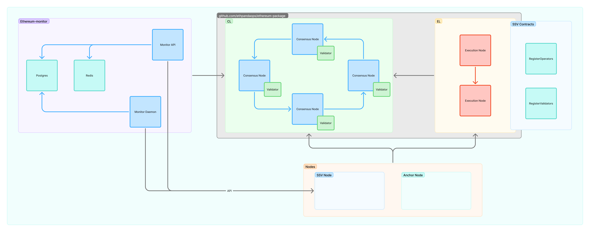

# SSV-Mini
Kurtosis devnet for running local SSV networks.

## Setup
- Docker
- Kurtosis
- Build local client images

```bash
git clone https://github.com/ssvlabs/ssv.git
git checkout %YOUR_BRANCH%
docker build -t node/ssv . 
```
```bash
git clone https://github.com/sigp/anchor.git
git checkout origin/unstable
docker build -f Dockerfile.devnet -t node/anchor . 
```
```bash
git clone https://github.com/ssvlabs/ethereum2-monitor.git
docker build -t monitor . 
```


## Interaction

### Running 

```bash
make run
```

View the logs of the nodes
```
kurtosis service logs -f localnet {service-name}
```

### Viewing currently running services

```bash
make run
```


### Restarting SSV Nodes

```bash
make restart-ssv-nodes
```

**NOTE:** When making changes to SSV Nodes locally, you need to build a new Docker image: `docker build -t node/ssv .`. Then run the following command to redeploy the nodes to the local network: `make restart-ssv-nodes`

```sh
docker build -t node/ssv .

### Starting Over

Use this if you want to shutdown previous network and start one from genesis

```bash
make reset
```

### Goals 

- Anyone can run a SSV network on their pc
- Running any SSV commit on local testnet is easy and fast
- Local setup is similar to actual testnet
- Possible to scale by adding resources

## Architecture
